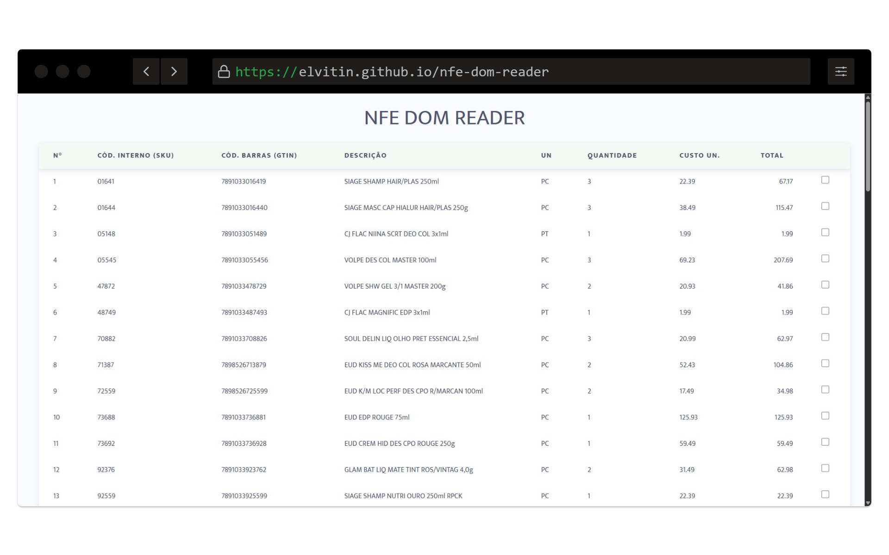

Look in: [English](/README_en.md) | Português

<h1> Opa, eai... </h1>

Sou um curioso que gosta de programas de computadores, sempre buscando aprender, gosta de explorar ferramentas e criar coisas 🚀🚀, aqui estão alguns dos meus projetos:

 

 
  <b> 
    <a href="https://elvitin.github.io/nfe-dom-reader" target="_blank">Nfe DOM Reader</a>
  </b>

Uma simples página HTML, CSS com Vanilla Js, que faz leitura des arquivos de Nota Fiscal eletrônica

👈🏽 <strong>Prévia</strong>

   
  

    
  

 

 
  <b> 
    <a href="https://github.com/elvitin/one-crypter" target="_blank">ONE crypter</a>
  </b>

Uma ferramenta que criptografa e descriptografa um texto qualquer, desenvolvida com tecnologias Web durante o programa estudos [ONE](https://www.oracle.com/br/one).

👈🏽 <strong>Prévia</strong>

   
  

    
    
  

