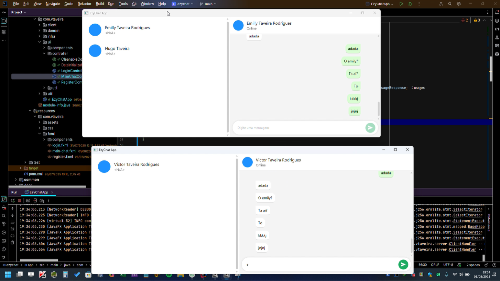
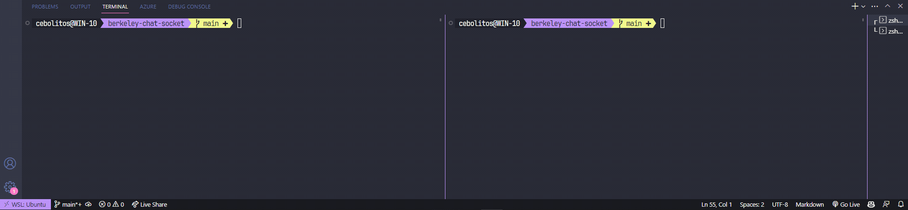

Look in: [English](/README_en.md) | Português

<h1> Opa, eai... </h1>

Sou um curioso que gosta de programas de computadores, sempre buscando aprender, gosta de explorar ferramentas e criar coisas 🚀🚀, aqui estão alguns dos meus projetos:

 

 
  <b> 
    <a href="https://github.com/elvitin/ezychat" target="_blank">EzyChat (Em progresso)</a>
  </b>

Um chat multi-usuários escrito em [Java](https://en.wikipedia.org/wiki/Java_(programming_language)) e tem [JavaFx](https://en.wikipedia.org/wiki/JavaFX) como tecnologia GUI, fortemente baseada no WhatsApp. Essa aplicação explora uma série de recursos e técnicas. O servidor tem como requisito essencial o uso de [multithreading](https://en.wikipedia.org/wiki/Multithreading_(computer_architecture)) usando [Threads Java](https://en.wikipedia.org/wiki/Java_concurrency), isso para permitir várias linhas de execução paralelas, uma para cada cliente conectado. A comunicação se da exclusivamente sobre o protocolo [TCP](https://en.wikipedia.org/wiki/Transmission_Control_Protocol) da camada de transporte, ou seja, o protocolo subjacente da camada de aplicação é a propria aplicação fazendo o uso do [protobuf](https://en.wikipedia.org/wiki/Protocol_Buffers) para serialização e desserialização dos dados.

👈🏽 <strong>Prévia</strong>

   
  

    
  

 

 
  <b> 
    <a href="https://github.com/elvitin/bidirecional-unix-chat" target="_blank">Bidirecional Unix Chat</a>
  </b>

Um chat de texto escrito em [C](https://en.wikipedia.org/wiki/C_(programming_language)), que utiliza [Socket Unix](https://en.wikipedia.org/wiki/Unix_domain_socket) (baseado em arquivo) como forma de [comunicação interprocesso (IPC)](https://en.wikipedia.org/wiki/Inter-process_communication).

👈🏽 <strong>Prévia</strong>

   
  

    
  

 

 
  <b> 
    <a href="https://elvitin.github.io/nfe-dom-reader" target="_blank">Nfe DOM Reader</a>
  </b>

Uma simples página HTML, CSS com Vanilla Js, que faz leitura de arquivos de Nota Fiscal Eletrônica

👈🏽 <strong>Prévia</strong>

   
  

    
  

 

 
  <b> 
    <a href="https://github.com/elvitin/one-crypter" target="_blank">ONE crypter</a>
  </b>

Uma ferramenta que criptografa e descriptografa um texto qualquer, desenvolvida com tecnologias Web durante o programa estudos [ONE](https://www.oracle.com/br/one).

👈🏽 <strong>Prévia</strong>

   
  

    
    
  

